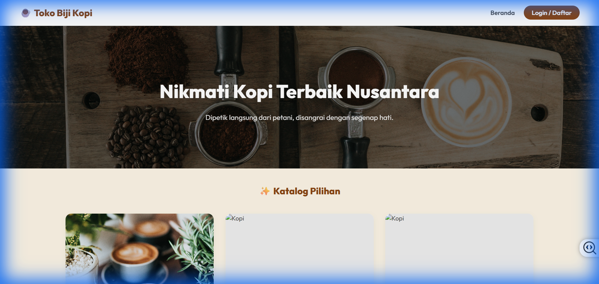
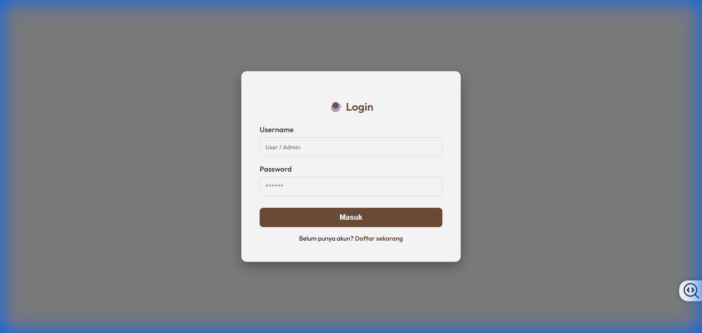
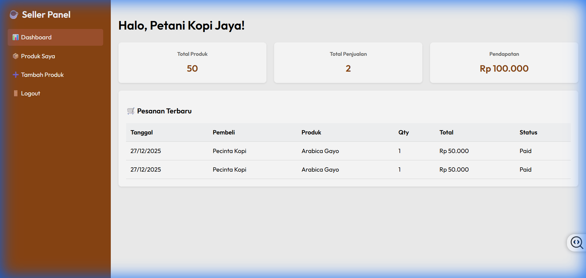
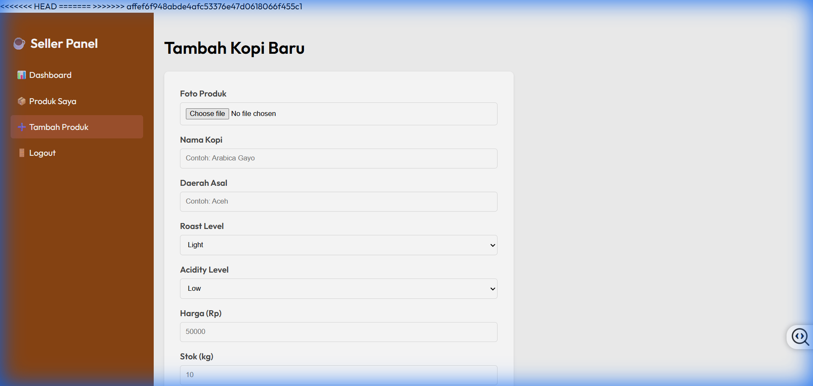
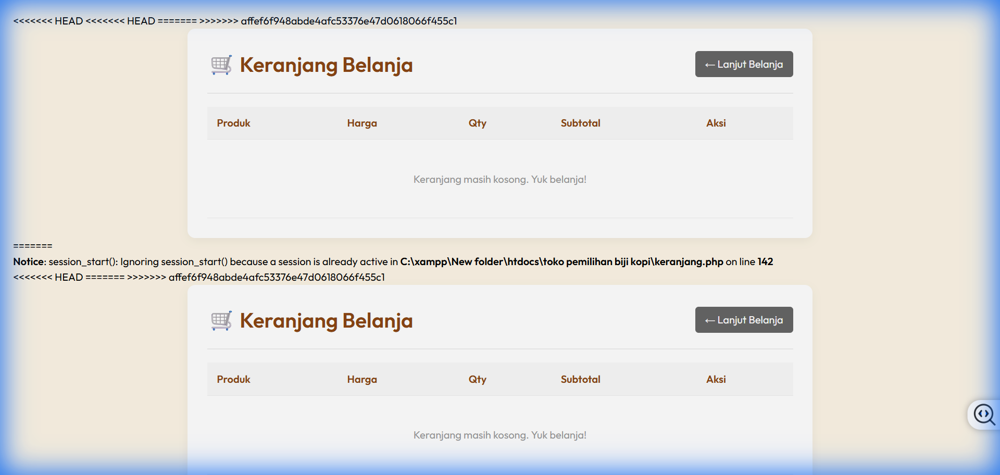
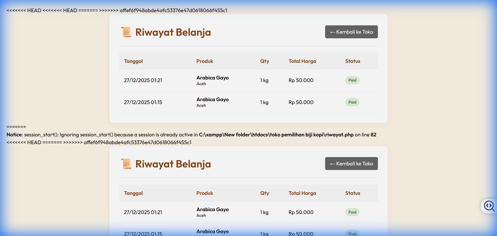
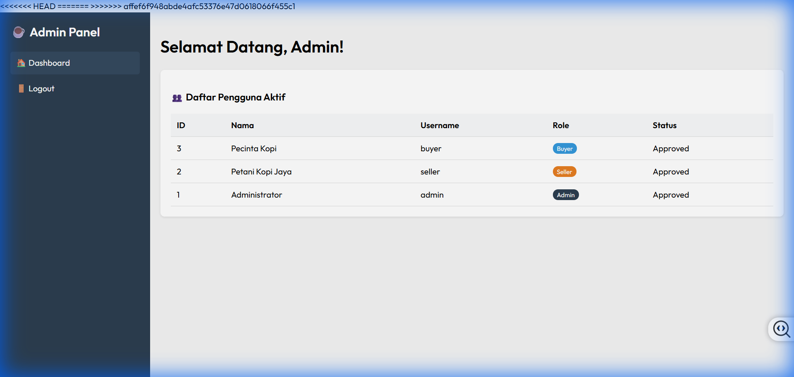

<<<<<<< HEAD
# ☕ Toko Pemilihan Biji Kopi

Aplikasi e-commerce sederhana untuk penjualan biji kopi nusantara, dibangun dengan PHP Native dan MySQL. Platform ini menghubungkan petani kopi (Seller) dengan penikmat kopi (Buyer).



## 📸 Galeri Aplikasi

**User & Seller Panel**




**Buyer Features**



**Admin Panel**


## ✨ Fitur Utama

- **Multi-Role User**:
  - **Admin**: Validasi pendaftaran seller.
  - **Seller**: Mengelola produk (CRUD) dan melihat penjualan.
  - **Buyer**: Melihat katalog, pencarian, keranjang belanja, dan checkout.
- **Manajemen Produk**: Upload gambar, set harga, stok, dan deskripsi kopi (Roast Level, Acidity).
- **Proses Transaksi**: Checkout sederhana dan riwayat pembelian.
- **Desain Responsif**: Antarmuka modern menggunakan CSS native.

## 🛠️ Teknologi

- **Backend**: PHP (Native)
- **Database**: MySQL
- **Frontend**: HTML5, CSS3 (Modern UI)
- **Server**: Apache (via XAMPP)

## 🚀 Instalasi

1. **Clone/Download** repositori ini.
2. Pindahkan folder proyek ke dalam direktori `htdocs` pada instalasi XAMPP Anda.
   ```
   C:\xampp\htdocs\toko pemilihan biji kopi
   ```
3. Nyalakan **Apache** dan **MySQL** melalui XAMPP Control Panel.
4. Buka browser dan akses:
   ```
   http://localhost/toko%20pemilihan%20biji%20kopi/setup_db.php
   ```
5. Setelah setup selesai, akses aplikasi utama di:
   ```
   http://localhost/toko%20pemilihan%20biji%20kopi/index.php
   ```

## 🔑 Akun Default (Demo)

| Role | Username | Password |
|------|----------|----------|
| **Admin** | `admin` | `admin` |
| **Seller** | `seller` | `seller` |
| **Buyer** | `buyer` | `buyer` |
=======
# ☕ Toko Pemilihan Biji Kopi

Aplikasi e-commerce sederhana untuk penjualan biji kopi nusantara, dibangun dengan PHP Native dan MySQL. Platform ini menghubungkan petani kopi (Seller) dengan penikmat kopi (Buyer).


## 📸 Galeri Admin Panel

**Login Page**


**Seller Dashboard**


## ✨ Fitur Utama

- **Multi-Role User**:
  - **Admin**: Validasi pendaftaran seller.
  - **Seller**: Mengelola produk (CRUD) dan melihat penjualan.
  - **Buyer**: Melihat katalog, pencarian, keranjang belanja, dan checkout.
- **Manajemen Produk**: Upload gambar, set harga, stok, dan deskripsi kopi (Roast Level, Acidity).
- **Proses Transaksi**: Checkout sederhana dan riwayat pembelian.
- **Desain Responsif**: Antarmuka modern menggunakan CSS native.

## 🛠️ Teknologi

- **Backend**: PHP (Native)
- **Database**: MySQL
- **Frontend**: HTML5, CSS3 (Modern UI)
- **Server**: Apache (via XAMPP)

## 🚀 Instalasi

1. **Clone/Download** repositori ini.
2. Pindahkan folder proyek ke dalam direktori `htdocs` pada instalasi XAMPP Anda.
   ```
   C:\xampp\htdocs\toko pemilihan biji kopi
   ```
3. Nyalakan **Apache** dan **MySQL** melalui XAMPP Control Panel.
4. Buka browser dan akses:
   ```
   http://localhost/toko%20pemilihan%20biji%20kopi/setup_db.php
   ```
5. Setelah setup selesai, akses aplikasi utama di:
   ```
   http://localhost/toko%20pemilihan%20biji%20kopi/index.php
   ```

## 🔑 Akun Default (Demo)

| Role | Username | Password |
|------|----------|----------|
| **Admin** | `admin` | `admin` |
| **Seller** | `seller` | `seller` |
| **Buyer** | `buyer` | `buyer` |
>>>>>>> affef6f948abde4afc53376e47d0618066f455c1
